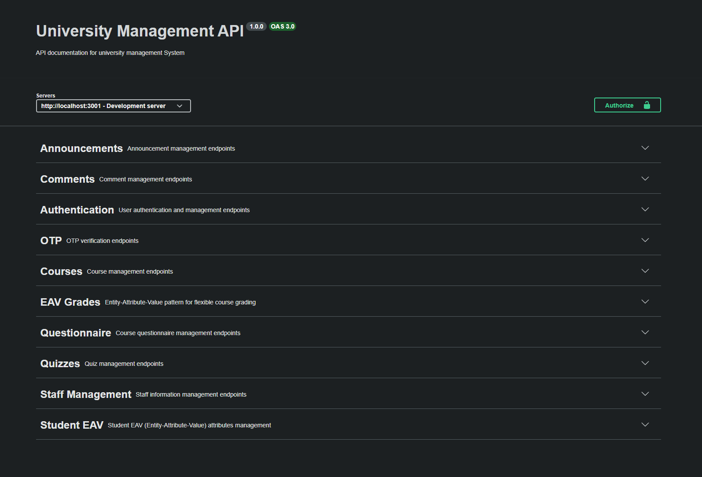
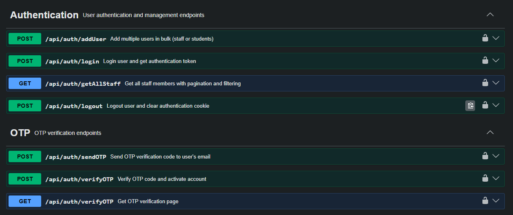
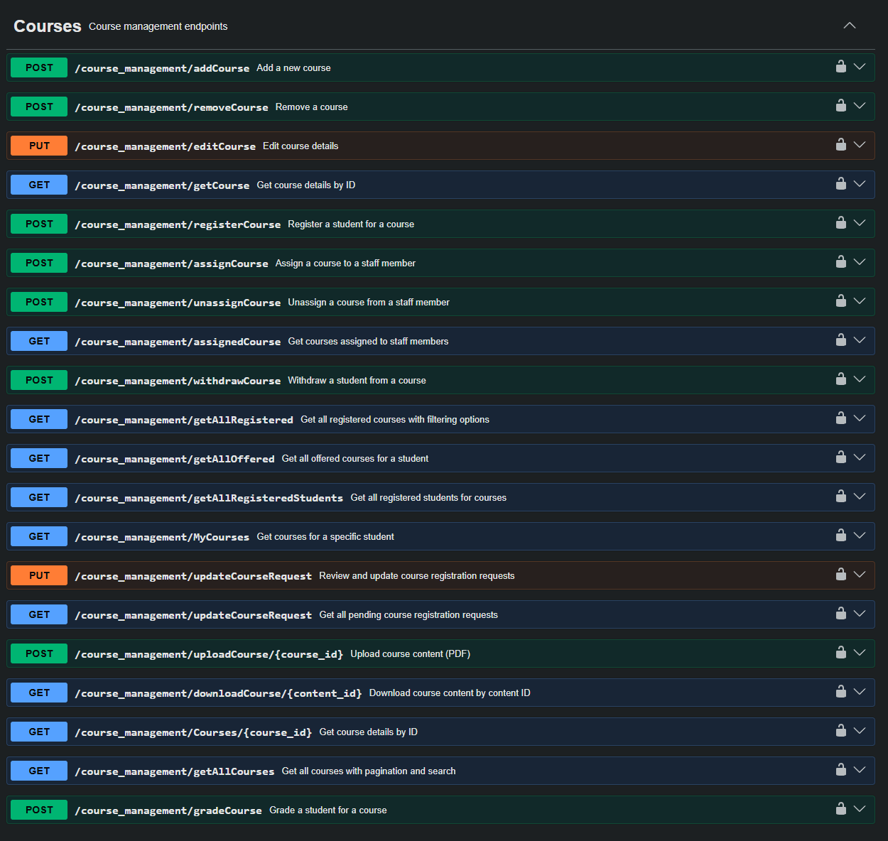
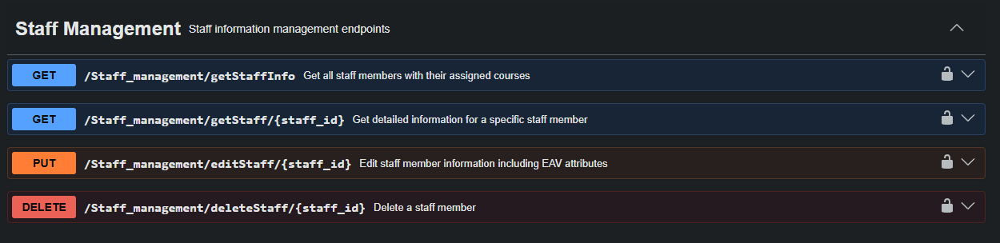
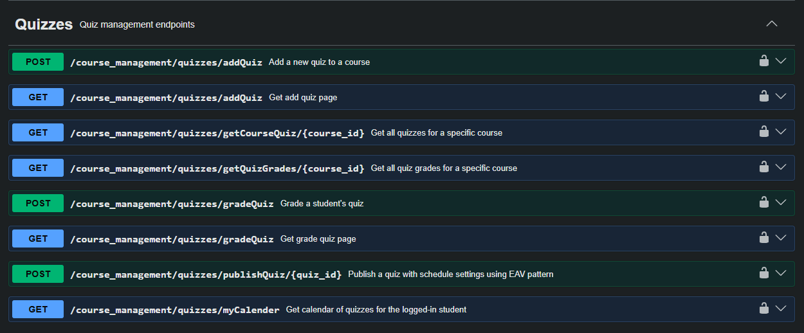
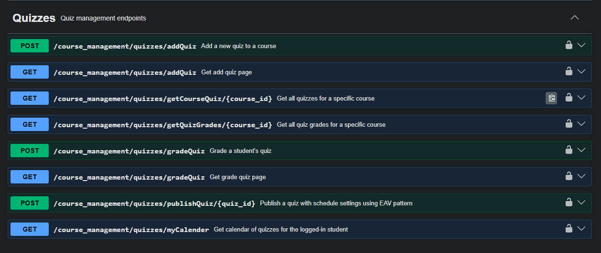
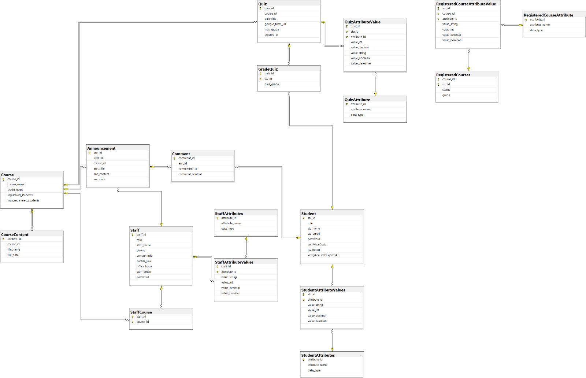

# University Management System — Backend API

A RESTful backend API for the University Management System, built with **Express.js** and **Microsoft SQL Server**. Fully documented with Swagger UI and structured around role-based access for Admins, Doctors, TAs, and Students. With protected endpoints through jwt auth.

---

## Tech Stack

- **Runtime:** Node.js
- **Framework:** Express.js
- **Database:** Microsoft SQL Server (MSSQL)
- **API Docs:** Swagger UI (OAS 3.0)
- **Auth:** Cookie-based JWT with OTP email verification

---

## Swagger UI Screenshots

### Overview — All Endpoint Groups

---

### Authentication & OTP Endpoints


---

### Course Management Endpoints


---

### Staff Management Endpoints


---

### Quizzes & Grading Endpoints

---

### Announcements & Questionnaire Endpoints

---

## Key Features

### JWT Auth
New users are added in bulk by admins.They can login through their credentials. All endpoints are protected through role based access verified by jwt bearer tokens.

### EAV Pattern for Flexible Grading
Classwork grades and staff/student attributes use the **Entity-Attribute-Value** pattern, allowing dynamic, schema-flexible grading (assignments, participation, lab work, etc.) without database migrations.

### Quiz Scheduling via EAV
Quizzes can be published with custom schedule settings stored using the EAV pattern — giving instructors full control over timing and availability.

### Student Quiz Calendar
A dedicated endpoint aggregates all upcoming quizzes for a logged-in student into a calendar view, consumed directly by the frontend.

### Multi-layer Grading
The API supports quiz-level grading (`gradeQuiz`), classwork/EAV grading (`addClassworkGrades`), and overall course grading (`gradeCourse`) as separate concerns, giving instructors granular control.

---

## API Endpoint Groups

| Tag | Base Path | Responsibility |
|-----|-----------|---------------|
| **Authentication** | `/api/auth` | Login, logout, bulk user creation |
| **OTP** | `/api/auth` | Email OTP send & verify for account activation |
| **Courses** | `/course_management` | CRUD, registration, assignment, content upload |
| **EAV Grades** | `/course_management` | Flexible classwork grading via EAV |
| **Quizzes** | `/course_management/quizzes` | Add, publish, grade, and fetch quizzes |
| **Staff Management** | `/Staff_management` | CRUD staff, fetch assigned courses |
| **Student EAV** | `/Staff_management` | Dynamic student attribute management |
| **Announcements** | `/announcemnts` | Create, edit, delete, and fetch announcements |
| **Comments** | `/announcemnts` | Comment threads on announcements |
| **Questionnaire** | `/questionnaire` | Course questionnaire questions |

---

## Getting Started

### Prerequisites
- Node.js 18+
- Microsoft SQL Server (local or remote)
- npm / yarn

### Installation

```bash
# Clone the repository
git clone repo-url

# Install dependencies
npm install

# Set up environment variables
cp .env.example .env

# run the server
nodemon index.js
```


The server will start at `http://localhost:3001`.  
Swagger docs are available at `http://localhost:3001/api-docs`.

---

## API Documentation

This API is documented using **Swagger UI (OAS 3.0)**.

Once the server is running, visit:

```
http://localhost:3001/api-docs
```

All endpoints are grouped by feature and include request/response schemas, required parameters, and authentication requirements.

---

## Database

- **Engine:** Microsoft SQL Server
- **Pattern:** Relational schema with EAV extensions for flexible attributes
- **EAV usage:** Classwork grades, quiz schedule settings, student/staff dynamic attributes

### ERD


